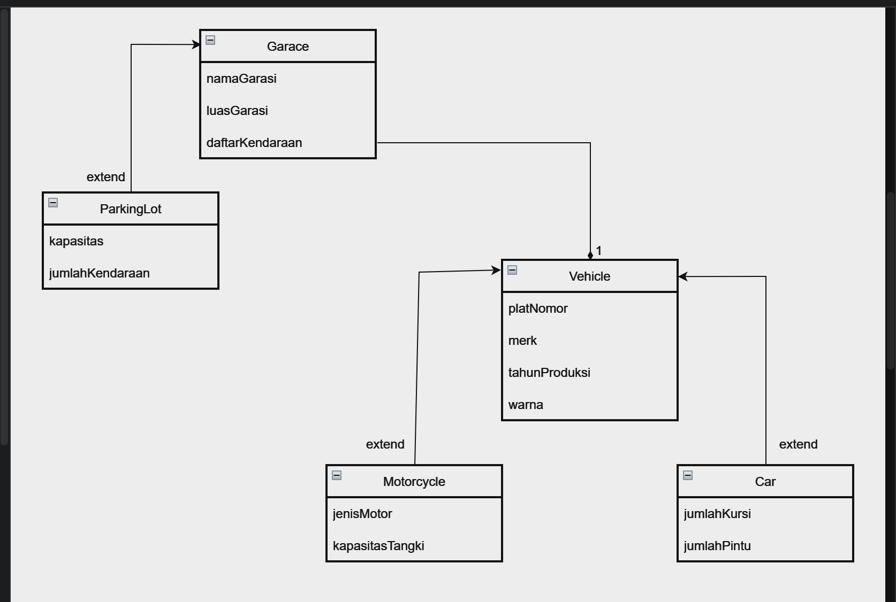
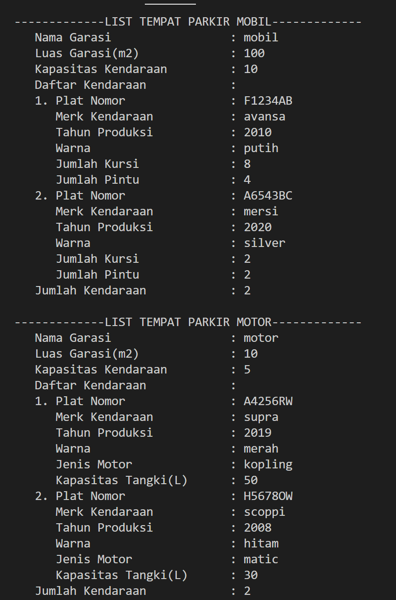
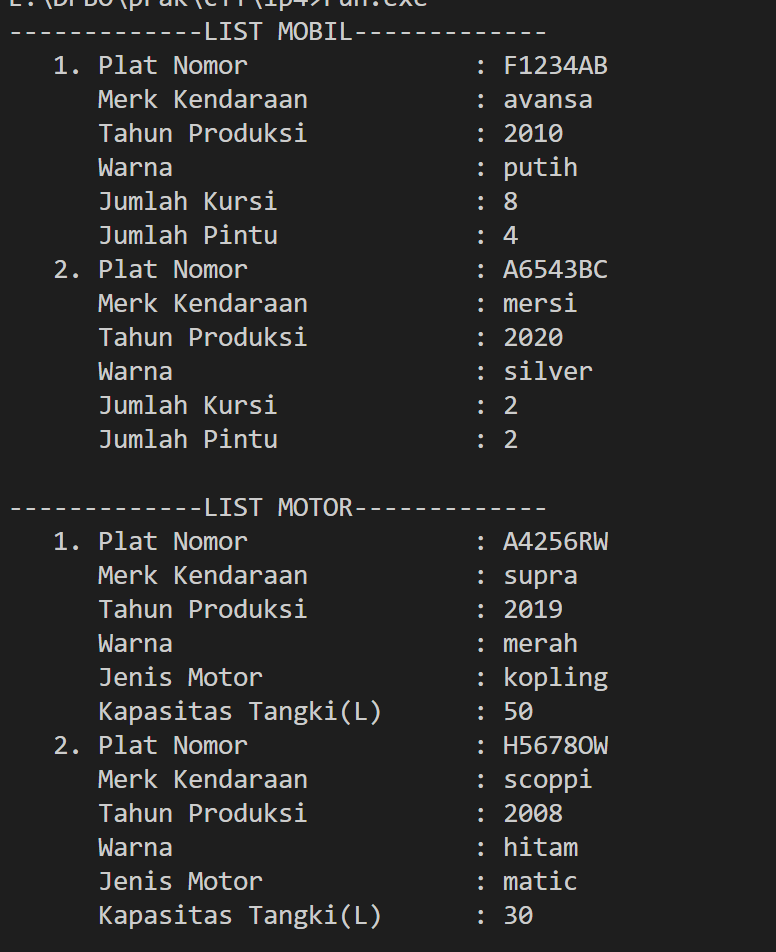

# Janji
Saya Raya Cahya Nurani NIM 2205714 mengerjakan soal Latihan Praktikum 2 dalam mata kuliah Desain Pemograman Berorientasi Objek untuk keberkahanNya maka saya tidak melakukan kecurangan seperti yang telah dispesifikasikan. Aamiin.

## Desain Program
Pada program ini class vehicle merupakan parent dari car dan motorcycle, dan garage memiliki anak yaitu parkingLot. yang nantinya garage akan mengcomposite dari vehicle.

Terdiri dari 5 class
* **Vehicle**
* **Car**
* **Motorcycle**
* **Garage**
* **ParkinLot**

Didalam class **Vehicle** memiliki 4 atribut, yaitu :
* platNomor
* merk
* tahunProduksi
* warna
Didalam class **Car** memiliki 2 atribut, yaitu : 
* jumlahKursi
* jumlahPintu
Didalam class **Motorcycle** memiliki 2 atribut, yaitu : 
* jenisMotor
* kapasitasTangki
Didalam class **Garge** memiliki 3 atribut, yaitu :
* namaGarasi
* luasGarasi
* daftarKendaraan
Didalam class **parkingLot** memiliki 2 atribut, yaitu :
* kapasitas
* jumlahKendaraan

## Alur Program
program ini awalnya akan membuat sebuah clas vehicle dan anaknya (car dan motorcycle) dengan atribut :
mobil
* platNomor
* merk
* tahunProduksi
* warna
* jumlahKursi
* jumlahPintu
motor
* platNomor
* merk
* tahunProduksi
* warna
* jenisMotor
* kapasitasTangki
dan menampilkannya dalam sebuah list

lalu akan membuat class garage dengan anaknya (parking lot) dengan atribut :
* namaGarasi
* luasGarasi
* daftarKendaraan
* kapasitas
* jumlahKendaraan
dan dalam atribut daftar kendaraan maka akan dicomposite dengan vehicle sehingga isi dari daftarKendaraan akan berupa sebuah list dari vehicle

##output 

